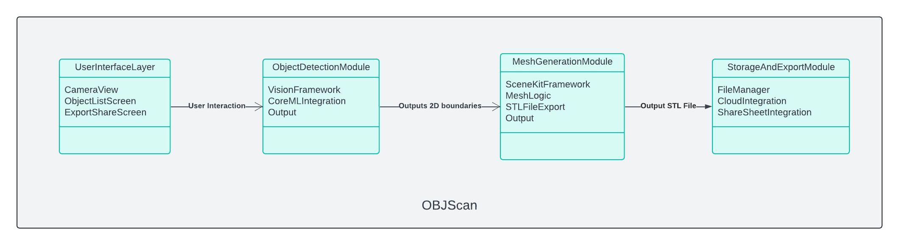

# OBJScan 📱➜🛠️

## **Project Overview**  
OBJScan is an iOS application that allows users to detect objects using the device camera and convert them into **3D STL files** for 3D printing or modeling. The app integrates real-time object detection, 3D mesh generation, and export functionalities.

---

## **Features**  
- **Real-Time Object Detection**:  
  Detect objects using the camera with Apple’s Vision framework and Core ML.
- **3D STL File Generation**:  
  Convert detected objects into 3D models and export as STL files.
- **File Management**:  
  Save, view, and share STL files locally or to cloud storage.
- **User-Friendly Interface**:  
  Clean UI to interact with the camera, view detected objects, and manage 3D files.

---

## **Architecture**  
### High-Level Diagram  


### **Components**  
1. **UI Layer**:  
   - Camera View  
   - Object List and Export Screen  

2. **Object Detection Module**:  
   - **Core ML** with Vision API to detect objects.  

3. **Mesh Generation Module**:  
   - Converts 2D boundaries into 3D meshes.  
   - Exports the 3D model as an STL file.

4. **Storage and Export Module**:  
   - Save files locally.  
   - iOS Share Sheet for exporting files.

---

## **Tech Stack**  
| **Component**           | **Technology**                     |
|--------------------------|------------------------------------|
| iOS Development          | Swift, Xcode                      |
| Object Detection         | Core ML, Vision Framework         |
| 3D Mesh & STL Generation | SceneKit, STL Export Libraries    |
| File Storage             | FileManager, iCloud Integration   |
| UI Design                | UIKit, SwiftUI                    |

---

## **Setup Instructions**

Follow these steps to set up and run the app locally:

1. **Pre-requisites**:  
   - Xcode (latest version)  
   - macOS (latest version)  
   - Swift knowledge is a plus.

2. **Clone the Repository**:  
   ```bash
   git clone https://github.com/username/object-detection-stl-converter.git
   cd object-detection-stl-converter
